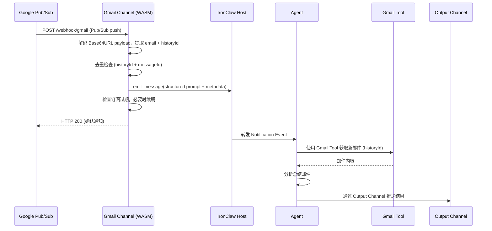
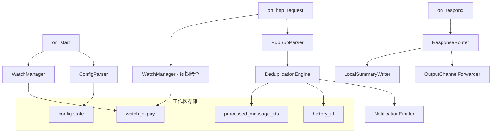
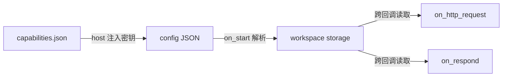

# Gmail Channel 技术设计文档

## 概述

Gmail Channel 是一个 Rust WASM channel 插件，遵循 IronClaw 的 `sandboxed-channel` WIT 接口规范。它通过 Google Pub/Sub 推送通知被动接收 Gmail 邮件变更事件，解析通知后将结构化的 Notification Event emit 给 Agent。Agent 使用已有的 Gmail Tool 获取邮件内容并分析，结果通过可配置的 Output Channel 推送给用户，或在未配置时保存到工作区本地。

与其他 channel（如 feishu、telegram）不同，Gmail Channel 不直接读取邮件内容，也不直接回复邮件。它是一个**单向事件通道**：接收 Pub/Sub 推送 → emit 给 Agent → Agent 通过其他 channel 输出结果。

### 核心数据流



## 架构

### 设计决策

**D1: 单向事件通道模式**
Gmail Channel 仅负责接收和转发通知事件，不直接调用 Gmail API 读取邮件。邮件读取由 Agent 通过已有的 Gmail Tool 完成。这样做的原因：
- 职责分离：channel 负责事件接收，tool 负责 API 交互
- 复用已有的 Gmail Tool，避免重复实现 Gmail API 调用逻辑
- OAuth token 管理集中在 tool 层，channel 仅需 watch API 的有限权限

**D2: 双层去重机制**
采用 History ID 单调递增比较 + Pub/Sub Message ID 集合两层去重：
- History ID 比较是主要机制，利用 Gmail 的递增特性高效过滤旧通知
- Message ID 集合处理完全重复的 Pub/Sub 投递（at-least-once 语义）
- 集合大小限制为 200 条，平衡去重效果和存储开销

**D3: Webhook 驱动的订阅续期**
Gmail watch 订阅最长 7 天有效。由于 `allow_polling: false`（与 feishu channel 一致），无法使用轮询机制。改为在每次 `on_http_request` 处理 Pub/Sub 通知时，顺带检查订阅过期时间，提前 24 小时续期。这种方式依赖于持续有邮件通知到达来触发续期检查，对于活跃邮箱是可靠的。

**D4: 可配置的输出路由**
响应输出支持两种模式：
- 配置 `output_channel` 时，在 emit 的元数据中标记目标 channel，由 Agent/路由层转发
- 未配置时，将摘要保存到工作区 `channels/gmail/summaries/` 目录作为 fallback

### WASM 沙箱约束

Gmail Channel 运行在 WASM 沙箱中，遵循以下约束：
- 每次回调是独立的 WASM 实例，无共享可变状态
- 跨回调状态通过 `workspace_read`/`workspace_write` 持久化
- HTTP 请求受 capabilities 文件中的白名单限制
- OAuth token 由 host 注入，WASM 永远不接触原始凭证
- 工作区写入自动添加 `channels/gmail/` 前缀

## 组件与接口

### WIT 接口实现

Gmail Channel 实现 `sandboxed-channel` world 中的 `channel` 接口：

```rust
struct GmailChannel;

impl Guest for GmailChannel {
    /// 解析配置，调用 watch API 建立订阅，注册 webhook 端点
    fn on_start(config_json: String) -> Result<ChannelConfig, String>;

    /// 接收 Pub/Sub 推送通知，解析、去重、emit 给 Agent
    fn on_http_request(req: IncomingHttpRequest) -> OutgoingHttpResponse;

    /// 不支持轮询（allow_polling: false）
    fn on_poll();

    /// 接收 Agent 响应，路由到 output channel 或保存本地
    fn on_respond(response: AgentResponse) -> Result<(), String>;

    /// 记录广播日志
    fn on_broadcast(user_id: String, response: AgentResponse) -> Result<(), String>;

    /// 无操作（Gmail 不支持状态指示器）
    fn on_status(update: StatusUpdate);

    /// 清理资源
    fn on_shutdown();
}
```

### 核心组件



#### ConfigParser — 配置解析

解析 `on_start` 接收的 JSON 配置，提取并持久化所有配置项：

```rust
#[derive(Debug, Deserialize)]
struct GmailConfig {
    /// Google Cloud Pub/Sub topic 全名（如 "projects/myproject/topics/mytopic"）
    pubsub_topic: String,
    /// 预期的 Pub/Sub 订阅名称（用于来源验证）
    pubsub_subscription: Option<String>,
    /// 监听的 Gmail 标签列表，默认为 ["INBOX"]
    #[serde(default = "default_label_ids")]
    label_ids: Vec<String>,
    /// 限制为单一用户的 owner ID
    owner_id: Option<String>,
    /// 输出 channel 名称（如 "feishu"、"slack"、"telegram"）
    output_channel: Option<String>,
}

fn default_label_ids() -> Vec<String> {
    vec!["INBOX".to_string()]
}
```

#### PubSubParser — Pub/Sub 消息解析

解析 Google Pub/Sub 推送的 HTTP POST 请求体。注意 `message.data` 字段使用 **Base64URL** 编码（URL-safe 变体，使用 `-` 和 `_` 替代 `+` 和 `/`，无填充），解码时必须使用 `base64::engine::general_purpose::URL_SAFE_NO_PAD`。

```rust
/// Google Pub/Sub 推送消息信封
#[derive(Debug, Deserialize)]
struct PubSubPushMessage {
    message: PubSubMessage,
    subscription: String,
}

/// Pub/Sub 消息体
#[derive(Debug, Deserialize)]
struct PubSubMessage {
    /// Base64URL 编码的通知数据（URL-safe，无填充）
    data: String,
    /// Pub/Sub 消息唯一 ID（与 Gmail 消息 ID 无关，用于去重）
    #[serde(alias = "messageId")]
    message_id: Option<String>,
    /// 发布时间
    #[serde(alias = "publishTime")]
    publish_time: Option<String>,
}

/// Base64URL 解码后的 Gmail 通知数据
#[derive(Debug, Deserialize)]
struct GmailNotificationData {
    #[serde(alias = "emailAddress")]
    email_address: String,
    #[serde(alias = "historyId")]
    history_id: String,
}
```

#### DeduplicationEngine — 去重引擎

双层去重机制：

1. **History ID 比较**：通知中的 `historyId` 必须大于已存储的值
2. **Message ID 集合**：维护最近 200 条已处理的 Pub/Sub `messageId`

```rust
/// 去重检查结果
enum DeduplicationResult {
    /// 新通知，应处理
    New,
    /// 旧的 History ID，跳过
    StaleHistoryId,
    /// 重复的 Message ID，跳过
    DuplicateMessageId,
}

fn check_deduplication(
    history_id: &str,
    message_id: Option<&str>,
) -> DeduplicationResult;
```

#### NotificationEmitter — 通知发射器

将解析后的通知格式化为结构化 prompt 并 emit 给 Agent：

```rust
/// emit 给 Agent 的元数据
#[derive(Debug, Serialize, Deserialize)]
struct GmailNotificationMetadata {
    email_address: String,
    history_id: String,
    notification_timestamp: String,
    /// 可选的输出 channel 名称
    output_channel: Option<String>,
}
```

emit 的消息内容是一个结构化 prompt，指示 Agent 使用 Gmail Tool：

```
New Gmail notification for {email_address}.
Use the gmail_fetch tool with history_id={history_id} to retrieve new messages, then summarize them.
```

#### WatchManager — 订阅管理

管理 Gmail watch API 订阅的建立和续期。由于 `allow_polling: false`，续期检查在 `on_http_request` 中每次收到 Pub/Sub 通知时执行：

```rust
/// 调用 Gmail watch API (POST https://www.googleapis.com/gmail/v1/users/me/watch)
/// 请求体: { "topicName": topic, "labelIds": label_ids, "labelFilterBehavior": "INCLUDE" }
/// topic: Pub/Sub topic 全名，如 "projects/myproject/topics/mytopic"
/// label_ids: 监听的标签列表，如 ["INBOX"]
fn call_watch_api(topic: &str, label_ids: &[String]) -> Result<WatchResponse, String>;

/// 检查并续期订阅（在 on_http_request 中调用）
fn check_and_renew_subscription() -> Result<(), String>;

#[derive(Debug, Deserialize)]
struct WatchResponse {
    #[serde(alias = "historyId")]
    history_id: String,
    expiration: String, // 毫秒时间戳
}
```

#### ResponseRouter — 响应路由

根据配置决定 Agent 响应的输出方式：

```rust
fn route_response(response: &AgentResponse, metadata: &GmailNotificationMetadata) -> Result<(), String> {
    if let Some(ref output_channel) = metadata.output_channel {
        // 在元数据中标记 output_channel，由 Agent/路由层转发
        // （实际转发由 host 处理）
        log_response_for_audit(response);
        Ok(())
    } else {
        // 保存到工作区本地
        save_summary_to_workspace(response, metadata)
    }
}
```

### 工作区存储路径

所有路径自动添加 `channels/gmail/` 前缀：

| 路径 | 用途 | 格式 |
|------|------|------|
| `state/history_id` | 最新已处理的 History ID | 字符串数字 |
| `state/watch_expiry` | Watch 订阅过期时间戳 | 毫秒时间戳字符串 |
| `state/processed_ids` | 已处理的 Pub/Sub Message ID 集合 | JSON 数组 |
| `state/owner_id` | 配置的 owner ID | 字符串 |
| `state/output_channel` | 配置的输出 channel | 字符串 |
| `state/pubsub_topic` | Pub/Sub topic 全名 | 字符串 |
| `state/pubsub_subscription` | 预期的订阅名称 | 字符串 |
| `state/label_ids` | 监听的 Gmail 标签列表 | JSON 数组 |
| `summaries/{timestamp}_{history_id}.md` | 本地保存的摘要文件 | Markdown |

## 数据模型

### 配置数据流



### Pub/Sub 推送消息结构

```
HTTP POST /webhook/gmail
Content-Type: application/json

{
  "message": {
    "data": "eyJlbWFpbEFkZHJlc3MiOiJ1c2VyQGV4YW1wbGUuY29tIiwiaGlzdG9yeUlkIjoiMTIzNDYifQ==",
    "messageId": "136969346945",
    "publishTime": "2024-01-01T00:00:00.000Z"
  },
  "subscription": "projects/myproject/subscriptions/mysubscription"
}

data Base64URL 解码后:
{
  "emailAddress": "user@example.com",
  "historyId": "12346"
}
```

### Emit 消息结构

```rust
EmittedMessage {
    user_id: "owner_id 或 email_address",
    user_name: None,
    content: "New Gmail notification for user@example.com.\nUse the gmail_fetch tool with history_id=12346 to retrieve new messages, then summarize them.",
    thread_id: None,
    metadata_json: r#"{"email_address":"user@example.com","history_id":"12346","notification_timestamp":"2024-01-01T00:00:00.000Z","output_channel":"feishu"}"#,
    attachments: vec![],
}
```

### 本地摘要文件格式

```markdown
# Gmail 邮件摘要

- **邮箱**: user@example.com
- **History ID**: 12346
- **通知时间**: 2024-01-01T00:00:00.000Z

## Agent 分析结果

{agent 响应内容}
```

### Capabilities 文件结构

```json
{
  "version": "0.1.0",
  "wit_version": "0.3.0",
  "type": "channel",
  "name": "gmail",
  "description": "Gmail push notification channel via Google Pub/Sub",
  "auth": {
    "secret_name": "google_oauth_token",
    "display_name": "Google",
    "oauth": {
      "authorization_url": "https://accounts.google.com/o/oauth2/v2/auth",
      "token_url": "https://oauth2.googleapis.com/token",
      "client_id_env": "GOOGLE_OAUTH_CLIENT_ID",
      "client_secret_env": "GOOGLE_OAUTH_CLIENT_SECRET",
      "scopes": [
        "https://www.googleapis.com/auth/gmail.readonly"
      ],
      "use_pkce": false,
      "extra_params": {
        "access_type": "offline",
        "prompt": "consent"
      },
      "pending_instructions": "If the provider blocks the shared OAuth app, configure your own Google OAuth Client ID and Client Secret in Setup or via GOOGLE_OAUTH_CLIENT_ID and GOOGLE_OAUTH_CLIENT_SECRET, then retry."
    },
    "env_var": "GOOGLE_OAUTH_TOKEN"
  },
  "setup": {
    "required_secrets": [
      {
        "name": "google_oauth_client_id",
        "prompt": "Google OAuth Client ID (from console.cloud.google.com/apis/credentials)"
      },
      {
        "name": "google_oauth_client_secret",
        "prompt": "Google OAuth Client Secret (from console.cloud.google.com/apis/credentials)"
      }
    ],
    "setup_url": "https://console.cloud.google.com/apis/credentials"
  },
  "capabilities": {
    "http": {
      "allowlist": [
        {
          "host": "www.googleapis.com",
          "path_prefix": "/gmail/v1/users/me/watch",
          "methods": ["POST"]
        }
      ],
      "credentials": {
        "google_oauth_token": {
          "secret_name": "google_oauth_token",
          "location": { "type": "bearer" },
          "host_patterns": ["www.googleapis.com"]
        }
      },
      "rate_limit": {
        "requests_per_minute": 60,
        "requests_per_hour": 500
      }
    },
    "secrets": {
      "allowed_names": ["google_oauth_token"]
    },
    "channel": {
      "allowed_paths": ["/webhook/gmail"],
      "allow_polling": false,
      "workspace_prefix": "channels/gmail/",
      "emit_rate_limit": {
        "messages_per_minute": 60,
        "messages_per_hour": 500
      }
    }
  },
  "config": {
    "pubsub_topic": null,
    "pubsub_subscription": null,
    "label_ids": ["INBOX"],
    "owner_id": null,
    "output_channel": null
  }
}
```

## 正确性属性

*正确性属性是在系统所有有效执行中都应成立的特征或行为——本质上是关于系统应该做什么的形式化陈述。属性是人类可读规范与机器可验证正确性保证之间的桥梁。*

### Property 1: Pub/Sub 载荷 Base64URL 往返一致性

*对于任意*有效的 Gmail 通知数据（包含任意合法 email 地址和任意正整数 history_id），将其序列化为 JSON 后进行 Base64URL 编码（URL-safe，无填充），再 Base64URL 解码并反序列化，应得到与原始数据等价的 email 地址和 history_id。

**Validates: Requirements 2.2**

### Property 2: History ID 单调递增去重

*对于任意*已存储的 history_id 值和任意通知中的 history_id 值，当且仅当通知的 history_id 严格大于已存储值时，该通知应被接受处理；否则应被跳过并返回 HTTP 200。

**Validates: Requirements 2.3, 7.1, 7.2**

### Property 3: 格式错误的载荷始终返回 HTTP 200

*对于任意*格式错误或缺少必要字段的 HTTP 请求体，`on_http_request` 应始终返回 HTTP 200 状态码（而非 4xx/5xx），以避免 Google Pub/Sub 的重试风暴。

**Validates: Requirements 2.4**

### Property 4: 有效通知 emit 包含结构化 prompt

*对于任意*有效的 Gmail 通知（包含任意合法 email 地址和任意 history_id），emit 给 Agent 的消息内容应包含该 email 地址、该 history_id，以及指示使用 Gmail Tool 的结构化指令。

**Validates: Requirements 3.1, 3.2**

### Property 5: Emit 元数据包含所有必需字段

*对于任意*有效的 Gmail 通知和任意 output_channel 配置，emit 的消息元数据 JSON 应包含 email_address、history_id 和 notification_timestamp 字段；当配置了 output_channel 时，元数据还应包含 output_channel 字段。

**Validates: Requirements 3.3, 4.2**

### Property 6: User ID 选择逻辑

*对于任意* owner_id 配置和任意通知 email 地址，当 owner_id 已配置时，emit 消息的 user_id 应为 owner_id；当 owner_id 未配置时，user_id 应为通知中的 email 地址。

**Validates: Requirements 3.4, 3.5**

### Property 7: 成功 emit 后 History ID 更新

*对于任意*成功处理的通知，处理完成后工作区中存储的 history_id 应等于该通知中的 history_id 值。

**Validates: Requirements 3.6**

### Property 8: 本地摘要文件包含完整信息

*对于任意* Agent 响应内容和任意通知元数据（email、history_id），当未配置 output_channel 时，保存的摘要文件应同时包含通知元数据（email 地址、history_id）和 Agent 的分析结果文本。

**Validates: Requirements 4.3, 4.4**

### Property 9: 订阅续期时间窗口

*对于任意*订阅过期时间戳和当前时间，当过期时间与当前时间之差小于 24 小时时，应触发续期调用；当差值大于等于 24 小时时，不应触发续期。续期检查在每次 `on_http_request` 处理通知时执行。

**Validates: Requirements 5.1, 5.2**

### Property 10: 订阅来源验证

*对于任意*配置的预期订阅名称和任意 Pub/Sub 推送消息中的 subscription 字段，仅当 subscription 与预期值匹配时才处理该通知。

**Validates: Requirements 6.1**

### Property 11: Message ID 去重集合有界性

*对于任意*长度的 Pub/Sub 消息 ID 序列，已处理的 Message ID 集合大小应始终不超过 200 条；当集合已满时，新增条目应淘汰最旧的条目。

**Validates: Requirements 7.3, 7.4, 7.5**

### Property 12: 配置解析完整性

*对于任意*包含各种可选字段组合的有效配置 JSON，`on_start` 应正确提取所有提供的字段并持久化到工作区存储，缺失的可选字段应使用默认值。

**Validates: Requirements 1.1**

## 后续改进

### Pub/Sub 推送 JWT 验证

当前版本通过检查请求体中的 `subscription` 字段来验证通知来源。后续版本应支持 Google Pub/Sub 推送订阅的 JWT 身份验证：Pub/Sub 服务会在推送请求的 `Authorization` 头中发送 Google 签名的 JWT，订阅者验证 JWT 签名和声明以确认通知确实来自 Google。这需要额外的 HTTP 白名单（获取 Google 公钥）和 JWT 解析/验证逻辑。

## 错误处理

### 错误分类与处理策略

| 错误场景 | 处理策略 | 原因 |
|----------|----------|------|
| 配置 JSON 解析失败 | 返回 `Err`，阻止 channel 启动 | 无法正常工作 |
| Watch API 调用失败 | 记录警告，继续启动 | 下次 webhook 请求时重试 |
| Pub/Sub 请求体解析失败 | 返回 HTTP 200，记录错误 | 避免 Pub/Sub 重试风暴 |
| Base64URL 解码失败 | 返回 HTTP 200，记录错误 | 同上 |
| 通知数据 JSON 解析失败 | 返回 HTTP 200，记录错误 | 同上 |
| 工作区读写失败 | 记录错误，尽力继续 | 非致命，可能丢失去重状态 |
| 订阅续期失败 | 记录错误，下次 webhook 请求时重试 | 订阅仍可能有效 |
| 摘要文件写入失败 | 记录错误 | 非致命，数据已 emit |

### 关键设计原则

1. **Pub/Sub 推送始终返回 HTTP 200**：Google Pub/Sub 对非 200 响应会进行指数退避重试，可能导致重试风暴。即使处理失败，也必须返回 200 确认接收。
2. **Watch API 失败非致命**：启动时 watch 失败不应阻止 channel 运行，下次收到 webhook 请求时会重试续期。
3. **去重状态丢失可恢复**：如果工作区存储不可用，最坏情况是重复处理一些通知，不会导致数据丢失。

## 测试策略

### 属性测试 (Property-Based Testing)

使用 `proptest` 库实现属性测试，每个属性测试至少运行 100 次迭代。

**适用的属性测试：**

- **Property 1 (Pub/Sub 载荷往返)**：生成随机 email 地址和 history_id，验证 Base64URL 编码/解码往返一致性
- **Property 2 (History ID 去重)**：生成随机 history_id 对，验证比较逻辑
- **Property 3 (错误载荷返回 200)**：生成随机格式错误的 JSON，验证始终返回 200
- **Property 4 (emit 内容)**：生成随机通知数据，验证 emit 消息包含所有必需信息
- **Property 5 (元数据完整性)**：生成随机通知和配置组合，验证元数据字段
- **Property 6 (user_id 选择)**：生成随机 owner_id 和 email 组合，验证选择逻辑
- **Property 7 (History ID 更新)**：生成随机通知序列，验证状态更新
- **Property 8 (摘要文件内容)**：生成随机响应和元数据，验证文件内容
- **Property 9 (续期时间窗口)**：生成随机时间戳对，验证续期决策
- **Property 10 (订阅验证)**：生成随机订阅名称，验证匹配逻辑
- **Property 11 (去重集合有界)**：生成长随机 ID 序列，验证集合大小不超过 200
- **Property 12 (配置解析)**：生成随机配置 JSON，验证解析完整性

每个属性测试标记格式：`Feature: gmail-channel, Property {N}: {property_text}`

### 单元测试

- 配置解析的具体示例（完整配置、最小配置、无效配置）
- Pub/Sub 消息解析的具体示例（有效消息、缺少字段、无效 Base64URL）
- Watch API 响应解析
- 摘要文件格式化的具体示例
- URL verification 或其他特殊请求的处理

### 集成测试

- 完整的 webhook 请求处理流程（从 HTTP 请求到 emit_message）
- webhook 请求中的订阅续期流程
- on_respond 的响应路由（output_channel vs 本地存储）
- Capabilities 文件的静态验证（类型、名称、白名单、密钥配置）

### 测试库选择

- 属性测试：`proptest`（Rust 生态中最成熟的 PBT 库）
- 单元/集成测试：标准 `#[cfg(test)]` 模块 + `serde_json` 构造测试数据
- 由于 WASM 沙箱限制，host API 调用（`channel_host::*`）需要通过 mock 或测试 harness 模拟
